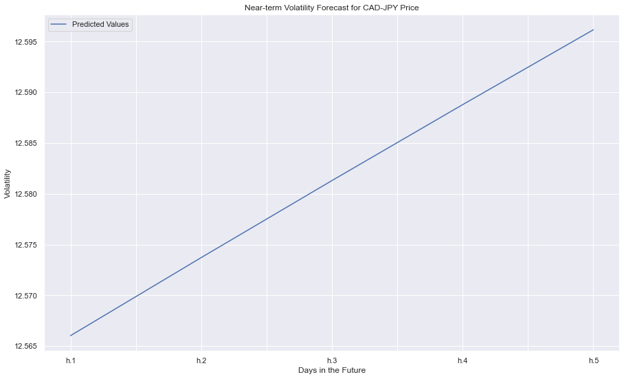

# Modelling and Forecasting Returns for CAD-JPY Price

## Background
The financial departments of large companies often have to make foreign currency transactions when doing international business, while hedge funds are also interested in anything that will provide an edge in predicting currency movements. Hence, both are always eager to gain a better understanding of the future direction and risk of various currencies.

We will aim to predict future movements of the Canadian dollar/Japanese yen price in this analysis. This will be done in two Jupyter Notebooks using **time series forecasting** with ARMA, ARIMA, and GARCH models, and **linear regression modelling**.

## ARMA, ARIMA, and GARCH Models

### Initial Time-Series Plotting

### Decomposition Using a Hodrick-Prescott Filter

### Forecasting Returns using an ARMA Model

### Volatility Forecasting with GARCH

