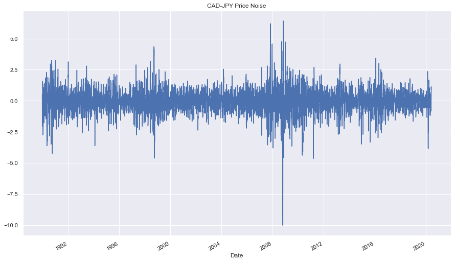

# Time Series Analysis: Predicting Returns for CAD-JPY Price

## Background
The financial departments of large companies often have to make foreign currency transactions when doing international business, while hedge funds are also interested in anything that will provide an edge in predicting currency movements. Hence, both are always eager to gain a better understanding of the future direction and risk of various currencies.

In this analysis we will predict future movements of the Canadian dollar/Japanese yen price. This will be done in two Jupyter Notebooks using **time series forecasting** with ARMA, ARIMA, and GARCH models, and **linear regression** with SciKit Learn.

## Time Series Forecasting

### Initial Time-Series Plotting

Looking at the price movement in the past 30 years, there is a pattern of consistent volatility.

### Decomposition Using a Hodrick-Prescott Filter

After extracting the noise signal from the data, we are left with a trend (the orange line). The trend helps us see long-term patterns clearer. Long-term volatility appears high for CAD-JPY.

The noise signal that was extracted from the original data represents volatility.

### Forecasting Returns using ARMA and ARIMA Models

The ARMA model forecasts a fluctuation in price, but with a p-value higher than 0.05, we cannot safely rely on this model.

The ARIMA model sees a decline in CAD-JPY price in the near future. Again though, the model's p-values are above 0.05, telling us this model is not a great fit.

### Volatility Forecasting with GARCH

The GARCH model predicts an increase in volatility over the next five days. This model returned very low p-values, so we can know that it has a higher likelihood of being correct.

## Linear Regression

A linear regression model was **trained** on the dataset ranging from 1990-2017 and **tested** against the remaining data from 2018-2020. The testing set (out-of-sample data) has a lower RMSE (Root Mean Squared Error) than the training set (in-sample data), indicating the model is not overfitted and should continue to be trained and tested.

## Conclusion

1. Based on your time series analysis, would you buy the yen now?

    I wouldn't buy the yen given the results of the analysis because:
    * The ARMA model's p-values are too high for the forecast to be reliable. In this case, we can throw away the results.
    * The ARIMA model has high p-values, indicating a low reliability for the forecast. This model also predicts a decline in price over the next five days.
    * The GARCH model forecasts an increase in volatility, making it more difficult to time the buy.

2. Is the risk of the yen expected to increase or decrease?

    The line in the chart beginning in the bottom-left and ending in the top-right indicates the volatility of the yen is expected to increase.
    
3. Based on the model evaluation, would you feel confident in using these models for trading?
    
    With the ARMA and ARIMA p-values greater than 0.05, I wouldn't be confident enough in those models to trade on. The GARCH model has extremely low p-values, indicating a great fit. I would experiment with trading based on the GARCH model results.
